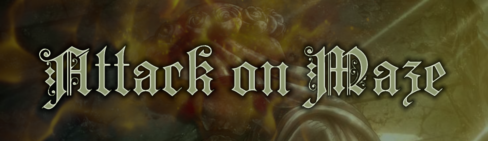
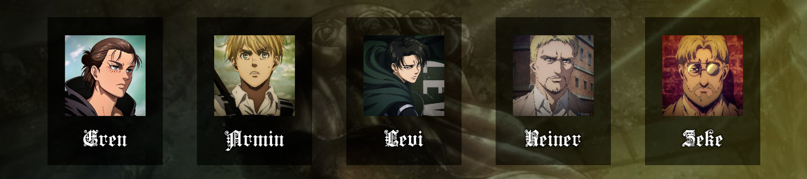
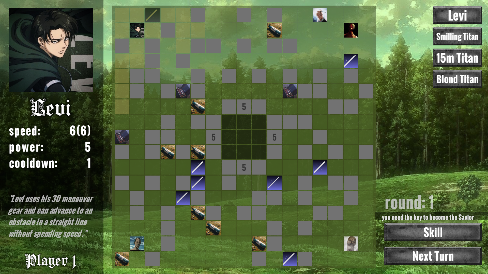
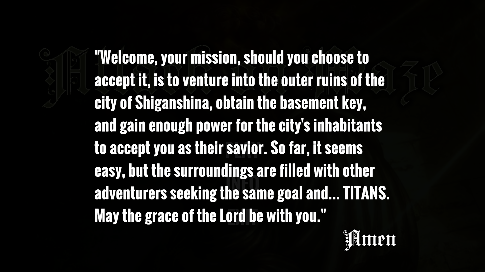

# Attack on Maze


Welcome to **Attack on Maze**! This is an exciting inspired by Attack on Titan, game developed in Unity.
## 📖 Description

**Attack on Maze** is a maze runner game where players seek to save a village besieged by Titans. Do you have what it takes to become the savior?

## 🌟 Features

- **Multiplayer Gameplay**: Compete against your friends.
- **Unique Characters**: Choose from various characters, each with special abilities.
 

- **Intelligent Titans**: As the game progresses, the Titans will make better decisions to destroy the walls.
- **Power Ups**: On your journey, you will find items that will aid you in your adventure.
- **Traps**: Watch your step!
- **Strategy and Skill**: Use your skills and strategies to outsmart your opponents.

## 🛠️ Technologies Used

This project was developed using the following technologies:

- Unity
- C#

## 📷 Screenshot




## 🚀 Getting Started

To get started with the project, follow these steps:

1. **Clone** the repository:
   ```sh
   git clone https://github.com/EricReyesMilian/AttackOnMaze.git
2. **Open** the project in Unity.

3. **Build** and run the project .

or download an executable of the game from the **Executables** folder depending on your OS (Android/Windows)

## 📄 Game Functionalities

- **Maze Generator**
Each game will feature a unique maze with all tiles accessible.
- **Player Management**
Players can choose from different characters with special abilities.
Each player has attributes such as speed and power.
- **Titan Management**
Enemies have artificial intelligence that will determine their behavior.
- **Turn System**
The game alternates between players.
Each turn consists of movement and possible menu interactions.
- **Traps and Power Ups**
They will be spread across the board tiles.
- **Victory Condition**
The game ends when a player enters the village or a Titan destroys the walls.


## 📧 Contact Information 

If you have any questions or feedback, feel free to reach out:

Email: ericruper73@gmail.com

GitHub: https://github.com/EricReyesMilian

## 🎉 Acknowledgments
A special thanks to all my professors who provided me with the knowledge to carry out this project. Play and become the savior!


